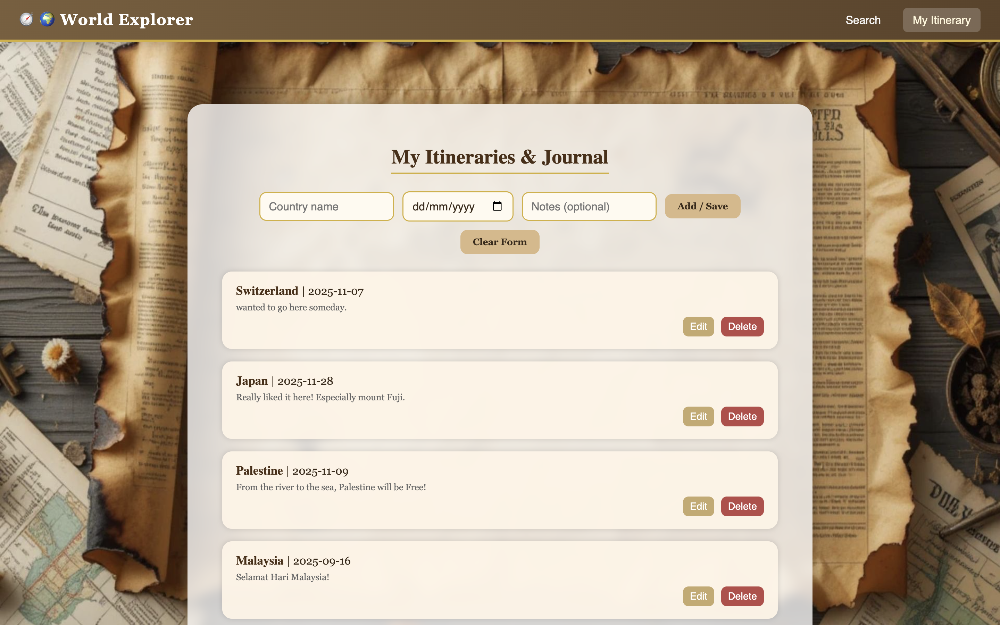

# 🌍 World Explorer

A vintage-themed desktop application built with **Electron.js** that allows users to search for countries, explore details via the **RESTCountries API**, and manage a personalized travel itinerary.

## ✨ Features
- Country search with real-time API integration
- Flag, capital, region, and population display
- Add / Edit / Delete itineraries (CRUD)
- Persistent storage via localStorage
- Vintage explorer map theme

## 🧠 Technologies
- Electron.js
- HTML, CSS, JavaScript (ES6)
- RESTCountries API
- Local Storage (JSON format)

## 🗂 Folder Structure
world-explorer/
├── main.js
├── preload.js
├── renderer.js
├── index.html
├── itinerary.html
├── style.css
├── package.json
└── assets/
    ├── bg-search.jpg
    ├── bg-itinerary.jpg

## 📸 Screenshots

| Search Page | Itinerary Page |
|--------------|----------------|
|  |  |
